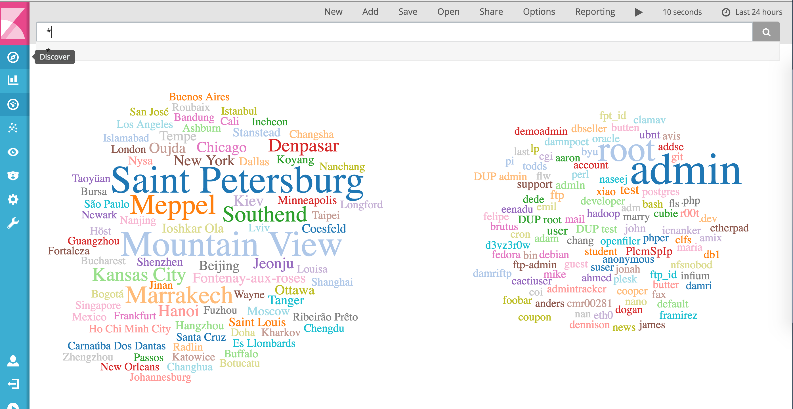

# Kibana Tag Cloud Plugin
A Tag Cloud Plugin for Kibana 5.0.1



This visualization was inspired by [Tim Roe's](https://www.timroes.de/) blog [post](https://www.timroes.de/2015/12/06/writing-kibana-4-plugins-visualizations-using-data/) on creating a tag cloud plugin for Kibana 5. It is built using [D3](d3js.org) and Jason Davie's [d3-cloud](https://github.com/jasondavies/d3-cloud) plugin.

### Requirements
Kibana 5.0.1  

### Installation steps
1. Download and unpack [Kibana](https://www.elastic.co/downloads/kibana).
Note the location as it will be used as $KIBANA_HOME.
2. Install the plugin with the following commands:

```
mkdir -p tmp/kibana
cd tmp/kibana
git clone https://github.com/stormpython/tagcloud.git
cd ../
$KIBANA_HOME/bin/kibana-plugin install file:///`pwd`/tagcloud.zip
```

### Disclosure
This repo is in its early stages. There is an outstanding [bug](https://github.com/stormpython/kibana-tag-cloud-plugin/issues/1) that needs to be fixed. In addition, please note d3-cloud's warning regarding how word clouds are rendered.

>Note: if a word cannot be placed in any of the positions attempted along the spiral, it is not included in the final word layout. This may be addressed in a future release.

### Issues
Please file issues [here](https://github.com/stormpython/kibana-tag-cloud-plugin/issues).
